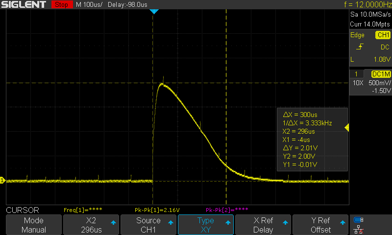
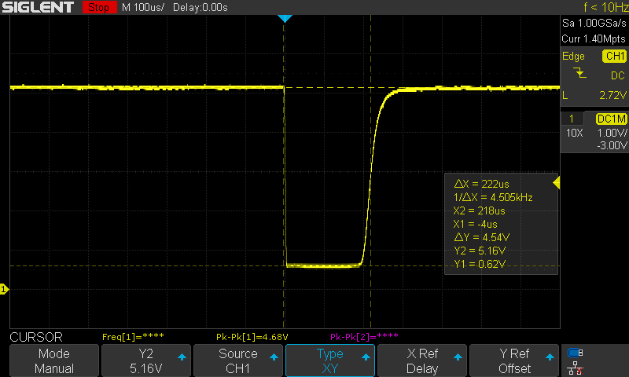

# IoT Geiger Counter with ESP32, OLED Display and Thingspeak Channel

- Measures radioactive gamma and beta radiation with quite good resolution at the typical low levels of the natural radiation (due to the big STS-6 tube)
- Displays the current counts per minute (CPM), estimated dose equivalent rate in micro-Sievert per hour (µS/h) and 10 minutes history with 5 second resolution as bargraph

- Low-power mode for use with batteries, OLED display and click sounds on, WiFi off
- WiFi mode for thingspeak data upload every minute, see https://thingspeak.com/channels/758223

Feel free to use this project as a base for your own projects AT YOUR OWN RISK!

# Hardware

- Russian Geiger counter tube STS-6 (CTC-6) at 400 V with ~5 M&#937; series resistor
- High voltage circuit from ArnoR at mikrocontroller.net https://www.mikrocontroller.net/topic/380666, schematic https://www.mikrocontroller.net/attachment/273334/HystereseStepUpTLC555-2.png. *Keep the high-voltage capacitor small to avoid dangerous charges! For safety avoid any contact with the high voltage parts!*
- ~400 µs pulse generation using Geiger tube series resistors as voltage divider, high impedance input to darlington transistor and TLC 555 timer for rectangle pulse generation (schematic and pulses see below)
- ESP32 board Wemos Lolin32
- OLED 128x64 with controller SH1106 at I2C
- Voltage supply from either USB or power supply or 3x 1.5V AAA batteries, circuit works stable from 3.0 V up to 5.0 V
- Pulse input is expected at GPIO 18 (high pulses with at least about 250 µs length)
- Switch for WiFi mode is expected at GPIO 4 (low=WiFi mode, high=low-power mode)
- OLED I2C bus is expected at GPIO 22 (SCK) and 21 (SDA)

# Software

- [PlatformIO VSCode project](https://github.com/platformio/platformio-vscode-ide) using [Arduino](https://github.com/arduino/Arduino) library, [Espressif ESP-IDF](https://github.com/espressif/esp-idf) for sleep functions and [U8g2](https://github.com/olikraus/u8g2) for display output
- Low-power mode uses light sleep, a wake-up for each signal pulse change and a wake-up every 1000 ms to update pulse statistics and OLED. This results in about 90% sleep. Could be improved using deep sleep and ULP. However, light sleep is already quite good and much easier.
- WiFi mode uses no sleep and simple interrupts for pulse counting. Pulse statistics and OLED are updated every 1000 ms, data is sent to thingspeak every 60 s.
- Credentials (WiFi SSID, password, thingspeak channel key) are declared in `credentials.h` and replaced by dummy values in `credentials.cpp` by default. Define your real secrets in a sibling file named `secret_credentials.h` (which is never committed!). It will automatically be included by `credentials.cpp` if it exists.

# Geiger Tube Pulse Forming

The 5.4 M&#937; series resistor is split up to reduce the voltage on each of them. The diode partially removes the noise spikes from the high voltage circuit.

This is the raw pulse at point A, about 2 V for less than 100 µs, then falling back to 0 V in the next several 100 µs. Remainings of the little noise spikes are still visible:

This is the formed pulse at point B, from 5 V to about 0.5 V for 200 µs:

It is then fed into a 555 timer to further extend its duration for the ESP32 wake-up from low-power mode.
