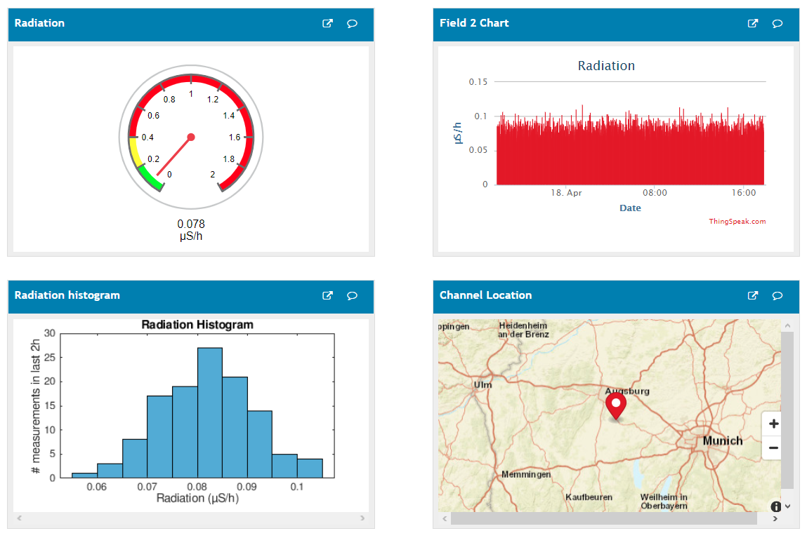

# IoT Geiger Counter with ESP32, OLED Display and Thingspeak Channel

- Measures radioactive gamma and beta radiation with already quite good resolution at the typical low levels of the background radiation (due to the big STS-6 tube)
- Displays the current counts per minute (CPM), estimated dose equivalent rate in micro-Sievert per hour (µS/h) and 10 minutes history with 5 second resolution as bargraph

- Low-power mode for use with batteries, OLED display and click sounds on, WiFi off
- WiFi mode for thingspeak data upload every minute, see https://thingspeak.com/channels/758223

Feel free to use this project as a base for your own projects AT YOUR OWN RISK!

# Hardware

- Russian Geiger counter tube STS-6 at 400 V with ~5 M&#937; series resistor
- High voltage circuit from ArnoR at mikrocontroller.net https://www.mikrocontroller.net/topic/380666, schematic https://www.mikrocontroller.net/attachment/273334/HystereseStepUpTLC555-2.png. *Keep the high-voltage capacitor small to avoid dangerous charges! For safety avoid any contact with the high voltage parts!*
- ~400 µs pulse generation using Geiger tube series resistors as voltage divider, high impedance input to darlington transistor and TLC 555 timer for rectangle pulse generation
- ESP32 board Wemos Lolin32
- OLED 128x64 with controller SH1106 at I2C
- Voltage supply from either USB or power supply or 3x 1.5V AAA batteries, circuit works from 3.0 V up to 5.0 V
- Pulse input is expected at GPIO 18 (high pulses with at least about 250 µs length)
- Switch for WiFi mode is expected at GPIO 4 (low=WiFi mode, high=low-power mode)
- OLED I2C bus is expected at GPIO 22 (SCK) and 21 (SDA)

# Software

- Eclipse sloeber project using Arduino library, ESP-IDF for sleep functions and u8g2 for display output
- Low-power mode uses light sleep, a wake-up for each signal pulse change and a wake-up every 1000 ms to update pulse statistics and OLED. This results in about 90% sleep. Could be improved using deep sleep and ULP. However, light sleep is already quite good and much easier.
- WiFi mode uses no sleep and simple interrupts for pulse counting. Pulse statistics and OLED are updated every 1000 ms, data is sent to thingspeak every 60 s.
- Credentials (WiFi SSID, password, thingspeak channel key) are only declared in `credentials.h` and must be defined in a `credentials.cpp`
